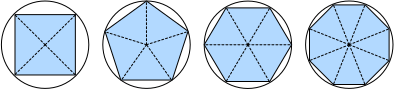
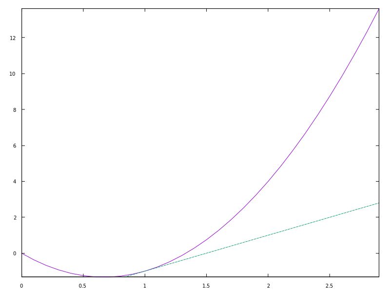

# Calculus

For a long time, how to calculate the area of a circle remained a mystery.
Then, in Ancient Greece, the mathematician Archimedes came up with the clever
idea to inscribe a series of polygons with increasing numbers of vertices on the
inside of a [circle](#fig_circle_area).  For a polygon with $$n$$ vertices, we
obtain $$n$$ triangles.  The height of each triangle approaches the radius $$r$$
as we partition the circle more finely.  At the same time, its base approaches
$$2 \pi r/n$$, since the ratio between arc and secant approaches 1 for a large
number of vertices.  Thus, the area of the polygon approaches $$n \cdot r \cdot
\frac{1}{2} (2 \pi r/n) = \pi r^2$$.

{:#fig_circle_area}

This limiting procedure is at the root of both *differential calculus* and
*integral calculus*.  The former can tell us how to increase or decrease a
function's value by manipulating its arguments.  This comes in handy for the
*optimization problems* that we face in deep learning, where we repeatedly
update our parameters in order to decrease the loss function.  Optimization
addresses how to fit our models to training data, and calculus is its key
prerequisite.  However, do not forget that our ultimate goal is to perform well
on *previously unseen* data.  That problem is called *generalization* and will
be a key focus of other chapters.


## Derivatives and Differentiation

Put simply, a *derivative* is the rate of change in a function with respect to
changes in its arguments.  Derivatives can tell us how rapidly a loss function
would increase or decrease were we to *increase* or *decrease* each parameter by
an infinitesimally small amount.  Formally, for functions $$f: \mathbb{R}
\rightarrow \mathbb{R}$$, that map from scalars to scalars, the *derivative* of
$$f$$ at a point $$x$$ is defined as

$$f'(x) = \lim_{h \rightarrow 0} \frac{f(x+h) - f(x)}{h}.$$

This term on the right hand side is called a *limit* and it tells us what
happens to the value of an expression as a specified variable approaches a
particular value.  This limit tells us what the ratio between a perturbation $$h$$
and the change in the function value $$f(x + h) - f(x)$$ converges to as we shrink
its size to zero.

When $$f'(x)$$ exists, $$f$$ is said to be *differentiable* at $$x$$; and when $$f'(x)$$
exists for all $$x$$ on a set, e.g., the interval $$[a,b]$$, we say that $$f$$ is
differentiable on this set.  Not all functions are differentiable, including
many that we wish to optimize, such as accuracy and the area under the receiving
operating characteristic (AUC).  However, because computing the derivative of
the loss is a crucial step in nearly all algorithms for training deep neural
networks, we often optimize a differentiable *surrogate* instead.


We can interpret the derivative $$f'(x)$$ as the *instantaneous* rate of change of
$$f(x)$$ with respect to $$x$$.  Let's develop some intuition with an example.
Define $$u = f(x) = 3x^2-4x$$.

```perl
pdl> sub f_x {
    my $x = shift;
    return 3 * $x ** 2 - 4 * $x;
}
```

Setting $$x=1$$, we see that $$\frac{f(x+h) - f(x)}{h}$$ approaches $$2$$ as
$$h$$ approaches $$0$$.  While this experiment lacks the rigor of a mathematical
proof, we can quickly see that indeed $$f'(1) = 2$$.

```perl
pdl> $h = 10 ** ones(5)->xlinvals(1,5)
pdl> print $h
[0.1 0.01 0.001 0.0001 1e-05]
pdl> print f_x(1)
-1
pdl> print f_x(1 + $h)
[-0.77 -0.9797 -0.997997000000001 -0.99979997 -0.9999799997]
pdl> $f_x_h = f_x(1 + $h) - $f_x(1)
pdl> $numerical_limit = $f_x_h / $h
[0.23 0.0202999999999998 0.00200299999999931 0.000200029999999796 2.00003000001558e-05]
pdl> print $numerical_limit
[2.3 2.02999999999998 2.00299999999931 2.00029999999796 2.00003000001558]
```

There are several equivalent notational conventions for derivatives.
Given $$y = f(x)$$, the following expressions are equivalent:

$$f'(x) = y' = \frac{dy}{dx} = \frac{df}{dx} = \frac{d}{dx} f(x) = Df(x) = D_x f(x),$$

where the symbols $$\frac{d}{dx}$$ and $$D$$ are *differentiation operators*.
Below, we present the derivatives of some common functions:

$$\begin{aligned} \frac{d}{dx} C & = 0 && \textrm{for any constant $C$} \\ \frac{d}{dx} x^n & = n x^{n-1} && \textrm{for } n \neq 0 \\ \frac{d}{dx} e^x & = e^x \\ \frac{d}{dx} \ln x & = x^{-1}. \end{aligned}$$

Functions composed from differentiable functions are often themselves
differentiable.  The following rules come in handy for working with compositions
of any differentiable functions $$f$$ and $$g$$, and constant $$C$$.

$$\begin{aligned} \frac{d}{dx} [C f(x)] & = C \frac{d}{dx} f(x) && \textrm{Constant multiple rule} \\ \frac{d}{dx} [f(x) + g(x)] & = \frac{d}{dx} f(x) + \frac{d}{dx} g(x) && \textrm{Sum rule} \\ \frac{d}{dx} [f(x) g(x)] & = f(x) \frac{d}{dx} g(x) + g(x) \frac{d}{dx} f(x) && \textrm{Product rule} \\ \frac{d}{dx} \frac{f(x)}{g(x)} & = \frac{g(x) \frac{d}{dx} f(x) - f(x) \frac{d}{dx} g(x)}{g^2(x)} && \textrm{Quotient rule} \end{aligned}$$

Using this, we can apply the rules to find the derivative of $$3 x^2 - 4x$$ via

$$\frac{d}{dx} [3 x^2 - 4x] = 3 \frac{d}{dx} x^2 - 4 \frac{d}{dx} x = 6x - 4.$$

Plugging in $$x = 1$$ shows that, indeed, the derivative equals $$2$$ at this
location.  Note that derivatives tell us the *slope* of a function at a
particular location.

## Visualization Utilities

We can visualize slopes of functions as `PDL` objects using the `PDL::Graphics::Simple` library.
The [PDL::Graphics::Simple](https://metacpan.org/pod/PDL::Graphics::Simple) manual talks about each function in detail, so we
will not describe it here. This library makes it really easy to plot `PDL`
objects.

Now we can plot the function $$u = f(x)$$ and its tangent line $$y = 2x - 3$$ at
$$x=1$$, where the coefficient $$2$$ is the slope of the tangent line, as seen
in [the figure](#fig_plot_calculus_001).

```perl
pdl> $x = xvals(30) * 0.1
pdl> print $x
[0 0.1 0.2 0.3 0.4 0.5 0.6 0.7 0.8 0.9 1 1.1 1.2 1.3 1.4 1.5 1.6 1.7 1.8 1.9 2 2.1 2.2 2.3 2.4 2.5 2.6 2.7 2.8 2.9]
pdl> use PDL::Graphics::Simple
pdl> line($x, f_x($x))
pdl> hold
pdl> line($x, 2 * $x - 3)
pdl> release
```

{:#fig_plot_calculus_001}{:.width="200px"}

To close an open plot window, you can run the `erase` command.

```perl
pdl> erase
```

## Partial Derivatives and Gradients

Thus far, we have been differentiating functions of just one variable.  In deep
learning, we also need to work with functions of _many_ variables.  We briefly
introduce notions of the derivative that apply to such _multivariate_ functions.


Let $$y = f(x_1, x_2, \ldots, x_n)$$ be a function with $$n$$ variables.  The
_partial derivative_ of $$y$$ with respect to its $$i^\textrm{th}$$ parameter
$$x_i$$ is

$$ \frac{\partial y}{\partial x_i} = \lim_{h \rightarrow 0} \frac{f(x_1, \ldots, x_{i-1}, x_i+h, x_{i+1}, \ldots, x_n) - f(x_1, \ldots, x_i, \ldots, x_n)}{h}.$$


To calculate $$\frac{\partial y}{\partial x_i}$$, we can treat $$x_1, \ldots,
x_{i-1}, x_{i+1}, \ldots, x_n$$ as constants and calculate the derivative of
$$y$$ with respect to $$x_i$$.  The following notational conventions for partial
derivatives are all common and all mean the same thing:

$$\frac{\partial y}{\partial x_i} = \frac{\partial f}{\partial x_i} = \partial_{x_i} f = \partial_i f = f_{x_i} = f_i = D_i f = D_{x_i} f.$$

We can concatenate partial derivatives of a multivariate function with respect
to all its variables to obtain a vector that is called the *gradient* of the
function.  Suppose that the input of function $$f: \mathbb{R}^n \rightarrow
\mathbb{R}$$ is an $$n$$-dimensional vector $$\mathbf{x} = [x_1, x_2, \ldots,
x_n]^\top$$ and the output is a scalar.  The gradient of the function $$f$$ with
respect to $$\mathbf{x}$$ is a vector of $$n$$ partial derivatives:

$$\nabla_{\mathbf{x}} f(\mathbf{x}) = \left[\partial_{x_1} f(\mathbf{x}), \partial_{x_2} f(\mathbf{x}), \ldots
\partial_{x_n} f(\mathbf{x})\right]^\top.$$

When there is no ambiguity, $$\nabla_{\mathbf{x}} f(\mathbf{x})$$ is typically
replaced by $$\nabla f(\mathbf{x})$$.  The following rules come in handy for
differentiating multivariate functions:

* For all $$\mathbf{A} \in \mathbb{R}^{m \times n}$$ we have $$\nabla_{\mathbf{x}} \mathbf{A} \mathbf{x} = \mathbf{A}^\top$$ and $$\nabla_{\mathbf{x}} \mathbf{x}^\top \mathbf{A}  = \mathbf{A}$$.
* For square matrices $$\mathbf{A} \in \mathbb{R}^{n \times n}$$ we have that $$\nabla_{\mathbf{x}} \mathbf{x}^\top \mathbf{A} \mathbf{x}  = (\mathbf{A} + \mathbf{A}^\top)\mathbf{x}$$ and in particular
$$\nabla_{\mathbf{x}} \|\mathbf{x} \|^2 = \nabla_{\mathbf{x}} \mathbf{x}^\top \mathbf{x} = 2\mathbf{x}$$.

Similarly, for any matrix $$\mathbf{X}$$,
we have $$\nabla_{\mathbf{X}} \|\mathbf{X} \|_\textrm{F}^2 = 2\mathbf{X}$$.


## Chain Rule

In deep learning, the gradients of concern are often difficult to calculate
because we are working with deeply nested functions (of functions (of
functions...)).  Fortunately, the *chain rule* takes care of this.  Returning to
functions of a single variable, suppose that $$y = f(g(x))$$ and that the
underlying functions $$y=f(u)$$ and $$u=g(x)$$ are both differentiable.  The
chain rule states that


$$\frac{dy}{dx} = \frac{dy}{du} \frac{du}{dx}.$$


Turning back to multivariate functions, suppose that $$y = f(\mathbf{u})$$ has
variables $$u_1, u_2, \ldots, u_m$$, where each $$u_i = g_i(\mathbf{x})$$ has
variables $$x_1, x_2, \ldots, x_n$$, i.e.,  $$\mathbf{u} = g(\mathbf{x})$$.
Then the chain rule states that

$$\frac{\partial y}{\partial x_{i}} = \frac{\partial y}{\partial u_{1}} \frac{\partial u_{1}}{\partial x_{i}} + \frac{\partial y}{\partial u_{2}} \frac{\partial u_{2}}{\partial x_{i}} + \ldots + \frac{\partial y}{\partial u_{m}} \frac{\partial u_{m}}{\partial x_{i}} \ \textrm{ and so } \ \nabla_{\mathbf{x}} y =  \mathbf{A} \nabla_{\mathbf{u}} y,$$

where $$\mathbf{A} \in \mathbb{R}^{n \times m}$$ is a *matrix* that contains the
derivative of vector $$\mathbf{u}$$ with respect to vector $$\mathbf{x}$$.
Thus, evaluating the gradient requires computing a vector--matrix product.  This
is one of the key reasons why linear algebra is such an integral building block
in building deep learning systems.


## Discussion

While we have just scratched the surface of a deep topic, a number of concepts
already come into focus: first, the composition rules for differentiation can be
applied routinely, enabling us to compute gradients _automatically_.  This task
requires no creativity and thus we can focus our cognitive powers elsewhere.
Second, computing the derivatives of vector-valued functions requires us to
multiply matrices as we trace the dependency graph of variables from output to
input.  In particular, this graph is traversed in a *forward* direction when we
evaluate a function and in a _backwards_ direction when we compute gradients.
Later chapters will formally introduce **backpropagation**, a computational
procedure for applying the chain rule.

From the viewpoint of optimization, gradients allow us to determine how to move
the parameters of a model in order to lower the loss, and each step of the
optimization algorithms used throughout this book will require calculating the
gradient.

## Exercises

1. So far we took the rules for derivatives for granted.  Using the definition
   and limits prove the properties for (i) $$f(x) = c$$, (ii) $$f(x) = x^n$$,
(iii) $$f(x) = e^x$$ and (iv) $$f(x) = \log x$$.
1. In the same vein, prove the product, sum, and quotient rule from first
   principles.
1. Prove that the constant multiple rule follows as a special case of the
   product rule.
1. Calculate the derivative of $$f(x) = x^x$$.
1. What does it mean that $$f'(x) = 0$$ for some $$x$$?  Give an example of a
   function $$f$$ and a location $$x$$ for which this might hold.
1. Plot the function $$y = f(x) = x^3 - \frac{1}{x}$$ and plot its tangent line
   at $$x = 1$$.
1. Find the gradient of the function $$f(\mathbf{x}) = 3x_1^2 + 5e^{x_2}$$.
1. What is the gradient of the function $$f(\mathbf{x}) = \|\mathbf{x}\|_2$$?
   What happens for $$\mathbf{x} = \mathbf{0}$$?
1. Can you write out the chain rule for the case where $$u = f(x, y, z)$$ and
   $$x = x(a, b)$$, $$y = y(a, b)$$, and $$z = z(a, b)$$?
1. Given a function $$f(x)$$ that is invertible, compute the derivative of its
   inverse $$f^{-1}(x)$$.  Here we have that $$f^{-1}(f(x)) = x$$ and conversely
$$f(f^{-1}(y)) = y$$.  Hint: use these properties in your derivation.

[Next - Automatic Differentiation](autograd.md) | [Previous - Linear Algebra](linear-algebra.md)
